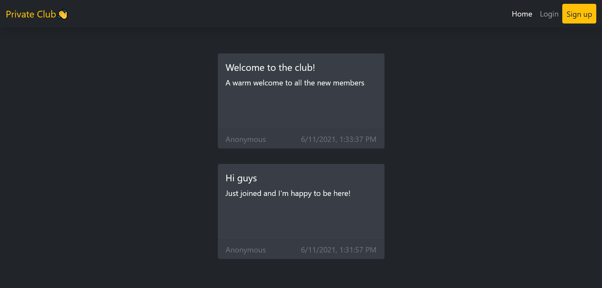

# Private Club

- [Summary](#Summary)
- [Features](#Features)
- [Technologies](#Technologies)
- [Screenshots](#Screenshots)
- [How to use](#How-to-use)

## Summary

Message board site where people can signup and post new messages. Only true members can see the names of the authors.

[Live Site](https://interestingclub.herokuapp.com/)

## Features

- Login / Signup pages
- Persistent login sessions
- See and post new messages on the board
- 3 types of users: visitors, members and admins/mods.
  - Members and admins can see the names of who posted.
  - Moderators can delete messages.
- Special pages for users to input secret codes and elevate their status in the club.

## Technologies

- HTML, CSS, Javascript
- Bootstrap
- Node.js
- Express
- EJS
- Passport
- Mongoose (MongoDB)

## Screenshots

## How to use

In the project directory, you can run:

### `npm start`

The website will be available locally on [localhost:3000](http://localhost:3000)
